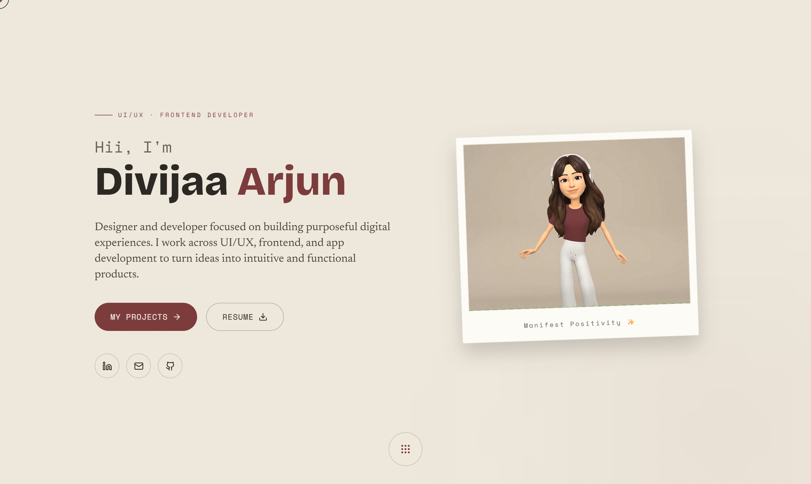
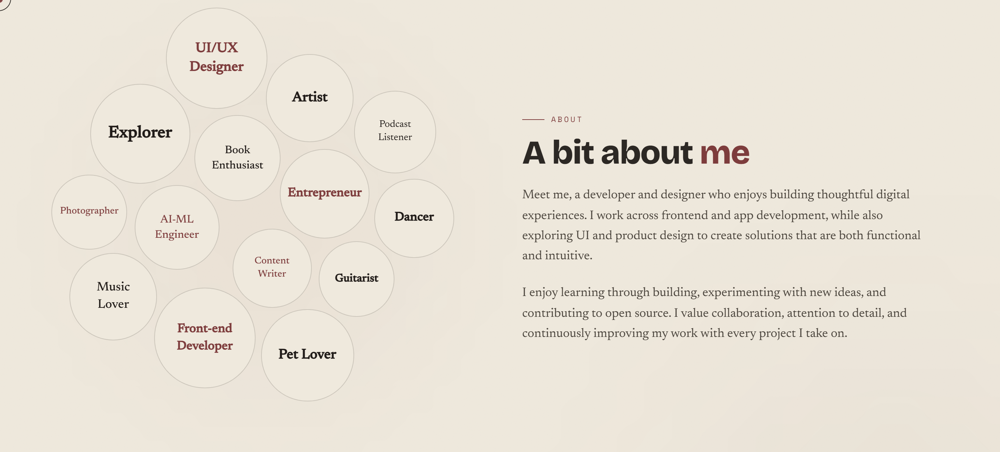

# Divijaa Arjun — Portfolio

A personal portfolio for a **UI/UX & Frontend Developer**, built around a warm
*studio-paper* aesthetic: a cream canvas, ink-dark type, and a single matte-maroon
accent. It leans on tactile, hand-made details — a polaroid-framed avatar, a cluster
of role "bubbles" you can push around with your cursor or finger, and a floating
dot-grid navigator — rather than the usual glassy gradients.



## Highlights

- **Interactive about cluster** — role tags float in a physics simulation (d3-force) and
  scatter away from your pointer; on touch devices they react to your finger too.
- **Polaroid hero** — the animated avatar sits in a tilted polaroid frame that straightens
  on hover.
- **Floating dot-grid nav** — expands on hover for desktop, taps open on mobile.
- **Custom cursor** — a soft trailing cursor on mouse devices, automatically disabled on touch.
- **Project carousel** — horizontally scrollable cards with image slideshows and live/code links.
- **Fully responsive** — desktop layout stays untouched while mobile gets its own tuned behaviour.

## Tech Stack

- **Next.js 14** (App Router) + **React 18**
- **TypeScript**
- **Tailwind CSS**
- **Framer Motion** — section + element animation
- **d3-force** — the about-bubble physics
- **GSAP** & **Three.js / react-three-fiber** — motion and visual effects
- **lucide-react** — icons
- **EmailJS** — contact form delivery

### Type & color

- Fonts: **Bricolage Grotesque** (display), **Newsreader** (serif body), **Space Mono** (mono labels)
- Palette: cream `#efe9dd` · ink `#2c2824` · maroon accent `#7d3c3c`

## Getting Started

```bash
npm install
npm run dev
```

Open [http://localhost:3000](http://localhost:3000).

## Project Structure

```
├── app/
│   ├── layout.tsx        # Root layout + fonts
│   ├── page.tsx          # Section composition
│   └── globals.css       # Theme tokens + global styles
├── components/
│   ├── Background.tsx     # Shared paper-grain backdrop
│   ├── Navigation.tsx     # Floating dot-grid navigator
│   ├── Cursor.tsx         # Custom trailing cursor (mouse only)
│   ├── Hero.tsx           # Intro + polaroid avatar
│   ├── About.tsx          # Interactive role-bubble cluster
│   ├── TechStack.tsx      # Tools & skills
│   ├── Projects.tsx       # Scrollable project carousel
│   ├── Experience.tsx     # Work / experience timeline
│   ├── Achievements.tsx   # Achievements (currently disabled)
│   ├── Contact.tsx        # Contact form
│   ├── Footer.tsx
│   └── GradientLine.tsx   # Section divider
├── data/                  # Projects, experience & achievements content
└── public/                # Images, video & preview screenshots
```

Content lives in `data/` — edit `projects.ts`, `experiences.ts`, and `achievements.ts`
to update what the site shows.

## Screenshots

**About**



## Build

```bash
npm run build
npm start
```

---

Designed & built by [Divijaa Arjun](https://github.com/Divii2205).
